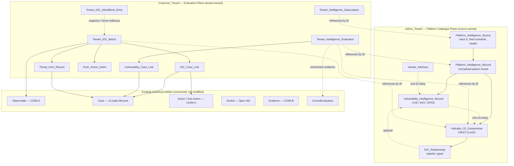

# Design Document

## Platform Intelligence and IOC Distribution

**Spec ID:** `platform-intelligence-ioc-distribution`
**Target version:** v1.4
**Phase:** Phase 1 — foundational data-layer augmentation (canonical entities, contracts, schemas, fixtures, tests only)
**Source doctrine:** Commander SDR baseline v2.6.2; Spec #59 Intelligence Layer Architecture; Spec #61 Universal Security Signal Connector Contract; Spec #29 Universal Risk Object and Case Binding; Spec #08 Case Management; Spec #62 Verdict Semantics; COIM v1.0 (Observable, Evidence, Action/Sub-Action).

---

## Overview

This design defines the **platform intelligence and IOC distribution data layer** for Commander SDR. It introduces platform-owned intelligence catalogues (CISA KEV, CVE/vendor advisories, direct IOC feeds, future MISP/STIX/TAXII and inbound email) and tenant-level intelligence evaluation, with the **Indicator of Compromise (IOC) modelled as a first-class intelligence object** rather than a child of CVE.

The design is deliberately constrained to a **Phase 1 data-layer-only scope**. The deliverables are:

- Canonical TypeScript contract entities under `packages/contracts/src/entities/` (future home per technology steering).
- Postgres-portable Drizzle schema definitions under `packages/db/src/schema/`.
- Deterministic seed/mock fixtures under `packages/contracts/src/fixtures/`.
- Pure-function logic for normalisation, deduplication, confidence aggregation, freshness evaluation, allow/block evaluation, and structural validation (`validateX` pattern) under `packages/contracts/src/` and `packages/rules/`.
- `DATA_DICTIONARY.md` entries and governance registration.

No UI pages, API endpoints, live external sync, live mailbox integration, live push to enforcement systems, or live customer/vendor data are in scope. Those remain Phase 2-gated per the connector readiness model.

### Design goals

1. **IOC as a first-class object.** IOCs have independent lifecycle, confidence, severity, TLP marking, expiry and source attribution. A CVE binding is optional and expressed only through a stateful `IOC_Relationship`.
2. **Admin/tenant separation without catalogue duplication.** The Admin_Tenant owns the raw intelligence catalogue; Customer_Tenants store only subscriptions, evaluations, matches, links and intents that *reference* platform records by ID.
3. **Closed-loop integrity.** IOC- and vulnerability-driven cases consume the existing 12-state case lifecycle, routing, SLA, validation and closure engines without bypass. KEV/EPSS enrichment informs priority but never creates tenant risk by itself.
4. **Canonical pattern conformance.** Every new entity carries CommonFields, TenantContext and SourceMetadata, follows the COIM ownership model (source-owned fields immutable after write; Commander-owned fields mutable), exposes `validateX` functions and array-form type constants, and uses deterministic `seedId` IDs in fixtures.
5. **Performance discipline by construction.** Workload class is declared on every data access; no cross-workload foreign keys; Postgres-portable schema only; high-volume catalogue tables are partition-ready with tenant-leading keys.
6. **Intelligence stream integrity.** All platform intelligence in this spec belongs to the **External Threat** stream (Spec #59) and is delivered through **connector class D — Threat Intelligence** (Spec #61). The four streams remain distinct; no fifth stream is introduced.

### Doctrine alignment summary

| Doctrine | How this design honours it |
|---|---|
| Four-stream integrity (Spec #59) | All entities tagged to the External Threat stream; no stream merge or fifth stream. |
| Connector classes A/B/C/D (Spec #61) | `Platform_Intelligence_Source.connectorClass` is fixed to class D. No new class invented. |
| Verdict semantics (Spec #62) | IOC actioning may "create or update a verdict" via the existing Verdict entity; verdicts remain semantic dispositions, not pass/fail. |
| Surface attribution (Spec #60) | Tenant evaluations and matches resolve against existing surface-attributed assets/identities/observables; attribution is preserved on the case, not flattened. |
| SOC read-only boundary | The data layer consumes intelligence and records evaluation/intent only. No SOC detections, rules or playbooks are written. Push actions are intent/status only. |
| Closed-loop case model (Assertion 1) | IOC/vuln cases are created and progressed only by the existing system-owned lifecycle; this spec adds link entities, never lifecycle bypass. |
| Registry-driven runtime | No routes/pages added; Team 2 surfaces deferred until PAGE_INVENTORY exists (Req 21.4, 25.3). |
| Three-layer token system | No UI in scope; not applicable to this data-layer phase. |
| Performance discipline (PD-1.0) | Workload-class declaration, no cross-workload FKs, Postgres-portable, partition-ready catalogue tables. |
| Local-first / no live AWS / no real vendor API | Seed/mock fixtures only; all sync, mailbox, push and external calls are modelled as status, deferred to Phase 2. |

---

## Architecture

### Layering

The intelligence data layer divides cleanly into a **platform (Admin_Tenant) catalogue plane** and a **tenant (Customer_Tenant) evaluation plane**, connected only by reference (entity IDs resolved at the application layer), never by physical foreign key across the boundary.



### Ingestion-to-evaluation flow (Phase 1: modelled, not live)

All ingestion paths converge on a single normalisation/dedup/relationship/evaluation pipeline. In Phase 1 every stage operates against seed/mock data; no stage performs a live external call.

```mermaid
flowchart LR
  A[Ingestion path<br/>direct feed / vendor advisory / CVE-embedded /<br/>inbound email / manual / commercial / MISP-STIX-TAXII] --> N[Normalise<br/>per iocCategory]
  N --> D[Deduplicate<br/>normalisedValue + iocCategory]
  D --> M{Existing<br/>catalogue entry?}
  M -- yes --> ME[Merge source attributions<br/>preserve originalRawValue<br/>recompute aggregate confidence]
  M -- no --> CR[Create IOC catalogue record]
  ME --> REL[Create / update IOC_Relationship]
  CR --> REL
  REL --> EV[Tenant evaluation<br/>against subscriptions]
  EV --> AB{Allow/Block<br/>list hit?}
  AB -- allow --> SUP[Suppress match,<br/>record suppression ref]
  AB -- block --> FORCE[Force malicious,<br/>ignore platform confidence]
  AB -- neither --> MATCH[Tenant_IOC_Match vs Observable]
  FORCE --> MATCH
  MATCH --> OUT[Outcomes: enrich / verdict /<br/>risk object / case / threat hunt /<br/>action recommendation / push intent]
```



### Module placement (future homes per technology steering)

| Concern | Location | Notes |
|---|---|---|
| Contract entities + type constants + `validateX` | `packages/contracts/src/entities/` | One module per entity, plus a shared `intelligence-common.ts` for shared enums (IOC_Category, TLP, relationship/evaluation states). |
| Composed value objects | `packages/contracts/src/entities/` | e.g. `SourceAttributionEntry`, `RelationshipStateTransition`, reusing COIM `SourceSeverity`/`SourceConfidence`. |
| Deterministic fixtures | `packages/contracts/src/fixtures/` | `seed-platform-intelligence-*.ts`, `seed-iocs.ts`, `seed-tenant-intelligence-*.ts` etc., all using `seedId()`. |
| Pure logic (normalise/dedup/aggregate/freshness/allow-block) | `packages/rules/` and/or `packages/contracts/src/resolvers/` | Pure functions, no I/O — the property-tested core. |
| Postgres schema | `packages/db/src/schema/` | Drizzle definitions; tenant-leading keys, partition-ready, no cross-workload FKs. |
| Tests | `tests/platform-intelligence-ioc-distribution/` | Unit + fixture-conformance + property-based tests. |

### Workload-class and tier posture

Per PD-1.0 §6 and the Database/Data Layer strategies, every data access declares a workload class. For this spec:

- **Catalogue writes** (source sync result materialisation, IOC ingestion/merge) → `ingestion-write`.
- **Catalogue reads** serving tenant evaluation and UI-bound resolution → `operational-read`.
- **Tenant evaluation/match/link/intent writes** → `operational-write`.
- **Freshness, exposure rollups, catalogue metrics** (future Unit 16b) → `analytics-read` via read-model abstraction.

At T1 all classes resolve to one Postgres connection; the declaration does not change at tier promotion. The catalogue tables (`indicator_of_compromise`, `platform_intelligence_record`) are declared high-volume and partition-ready.

### Cross-workload boundary rule

The platform catalogue plane and the tenant evaluation plane may eventually live in physically separate databases. Therefore **no foreign keys cross the Admin↔Customer boundary**. `Tenant_Intelligence_Evaluation.platformRecordId`, `Tenant_IOC_Match.iocId`, and `Tenant_Intelligence_Subscription.sourceId` are reference IDs resolved at the application layer (Req 17.3, 17.4). The same rule already applies to case references (`caseId`) per the existing Action/Sub-Action precedent.

---

## Components and Interfaces

This section describes the logical components (pure functions and validators). All are I/O-free in Phase 1 and operate on in-memory entities and fixtures.

### C1. IOC Normaliser (`normaliseIoc`)

Normalises a raw indicator value according to its `iocCategory`, producing a `normalisedValue` while always preserving `originalRawValue`.

- **Signature (conceptual):** `normaliseIoc(category: IocCategory, rawValue: string) → { normalisedValue: string, originalRawValue: string }`
- **Rules by category family:**
  - Domains/FQDN/sender_domain/email_address → lowercase, trim, reverse defanging (`hxxp`→`http`, `[.]`→`.`, `(dot)`→`.`).
  - URLs → reverse defanging, trim, preserve case of path, lowercase scheme + host.
  - IP/CIDR → trim, reverse defanging brackets, canonicalise (no leading zeros; IPv6 lowercased/compressed where deterministic).
  - Hashes (md5/sha1/sha256) → lowercase, trim, strip surrounding whitespace.
  - All categories → Unicode normalisation (NFC) and whitespace trimming as a baseline.
- **Determinism requirement:** `normaliseIoc` is pure and idempotent — `normaliseIoc(c, normaliseIoc(c, v).normalisedValue)` equals `normaliseIoc(c, v).normalisedValue`.

### C2. IOC Deduplicator + Source-Attribution Merger (`dedupAndMerge`)

Given an incoming normalised IOC and the existing catalogue, decides create-vs-merge by the key `(normalisedValue, iocCategory)` and merges per-source attributions.

- Merge preserves an array of `SourceAttributionEntry { sourceId, reportedConfidence, reportedSeverity, originalRawValue, firstSeenAt, lastSeenAt }` — one entry per reporting source, never collapsing distinct sources.
- `firstSeenAt` is the min across attributions; `lastSeenAt` the max.
- Merge is commutative and idempotent at the catalogue level (set semantics on source attribution by `sourceId`).

### C3. Confidence Aggregator (`aggregateConfidence`)

Computes a single catalogue-level `confidence` (0–100) from per-source reported confidences using a defined, deterministic aggregation function (Req 8.4).

- **Defined function:** a bounded, deterministic combiner satisfying the following owner-confirmed constraints (DEC-confidence-aggregation-properties):
  1. Output bounded to 0–100 (clamped).
  2. Higher-confidence corroborating sources must not reduce aggregate confidence (monotonicity w.r.t. high-confidence additions).
  3. Lower-confidence weak sources must not inflate confidence beyond a configured ceiling (saturation bound).
  4. Source freshness affects confidence — staler attributions contribute less weight.
  5. Direct tenant observation (matched by the tenant's own Observable) weighs more than generic feed presence.
  6. Manual analyst confirmation carries an explicit weighting boost (configurable constant).
  7. Deterministic: identical inputs always produce identical output.
- **Phase 1 authority:** No baseline-defined formula exists. The implementation must satisfy the seven constraints above. The exact constants and combiner shape live in `packages/rules/`; they are implementation choices provided the properties hold. Property P5 validates bounded + monotonic + source-preserving; the additional constraints (freshness weighting, tenant-observation boost, analyst-confirmation boost, ceiling) are validated by example tests in the test suite.

### C4. Feed Freshness Evaluator (`evaluateFreshness`)

Maps elapsed time since `lastSuccessfulSync` relative to `refreshCadenceMinutes` to one of `fresh | aging | stale | expired` (Req 2.4). Pure function of `(lastSuccessfulSync, refreshCadenceMinutes, now)`.

### C5. Feed Sync State Transition (`applySyncResult`)

Pure reducer modelling Req 2.2/2.3: given current schedule state and a sync result (success/failure + timestamp), returns the next schedule state (updates `lastSuccessfulSync`, computes `nextScheduledSync`, clears or records `failureState` with consecutive failure count). No live sync is performed; this models the state transition only (Req 2.5).

### C6. Allow/Block Evaluator (`evaluateAllowBlock`)

Given a candidate platform IOC and a tenant's allow/block list, returns a decision: `suppress (allow)`, `force_malicious (block)`, or `proceed` (Req 23.3/23.4). Block overrides platform confidence; allow suppresses the match and yields a suppression reference.

### C7. Relationship State Machine (`transitionRelationship`)

Records a stateful transition for an `IOC_Relationship` capturing `{ previousState, newState, changedAt, reason }` (Req 7.3). Validates that the target state is a member of the relationship-state taxonomy.

### C8. Validators (`validateX` family)

One structural validator per entity, returning a structured result `{ valid: boolean, errors: string[] }`, following the existing `validateObservable`/`validateEvidence`/`validateVerdict` pattern. Validators check required fields, enum membership, numeric ranges (confidence 0–100, severity 1–5), TLP membership, and array-shape correctness. Validators are structural only — they never consult lifecycle/priority/routing engines.

### C9. Tenant Evaluation / Match Builders (modelled)

Pure constructors that, given platform records and (seeded) tenant observables/assets/identities, produce `Tenant_Intelligence_Evaluation` and `Tenant_IOC_Match` records with evidence references and provenance. The match builder references the existing **Observable** entity (COIM-D) by ID, preserving its `tenant+type+value` deduplication model (Req 12.2).

### C10. Case/Action Outcome Mappers (modelled, non-bypassing)

Given an actioned IOC match, produce the *link* records (`IOC_Case_Link`, `Vulnerability_Case_Link`) and the *intent/recommendation* records (`Push_Action_Intent`, action recommendation) that the existing case lifecycle and COIM-H action engine consume. These mappers **never** create or transition a case directly — they emit the binding that the system-owned lifecycle acts on (Req 13.2, 14.4, 16.4).

### Interface conformance to existing patterns

| Pattern | Conformance |
|---|---|
| CommonFields (`id`, `tenant`, `createdAt`, `updatedAt`, `source`) | Present on every entity (Req 20.1). |
| TenantContext (`tenantId`, `tenantName`) | Present on every entity (Req 20.2). Admin entities carry the Admin_Tenant context. |
| SourceMetadata (`connectorId`, `importRunId`, `sourceSystem`, `sourceTimestamp`) | Present on every entity (Req 20.3). |
| `seedId()` deterministic IDs | All fixtures (Req 20.4). |
| `validateX` structural validators | One per entity (Req 20.5). |
| Array-form type constants (e.g. `IOC_CATEGORIES`, `TLP_MARKINGS`) | One per enum (Req 20.6). |
| COIM ownership model | Source-owned fields immutable after write; Commander-owned fields mutable (Req 20.7). |

---

## Data Models

All entities conform to CommonFields, TenantContext and SourceMetadata. Field tables below list entity-specific fields and note **ownership** (source-owned = immutable after write; Commander-owned = mutable) per the COIM model. DB schemas flatten `tenant` → `tenantId` and `source` → individual columns, matching the established reconciliation pattern.

### Shared enums / type constants

| Constant | Values |
|---|---|
| `PLATFORM_INTELLIGENCE_SOURCE_TYPES` | `cisa_kev`, `nvd_cve`, `vendor_advisory`, `commercial_ioc_feed`, `misp_feed`, `stix_taxii_feed`, `inbound_email`, `manual_submission` |
| `PLATFORM_RECORD_TYPES` | `cve`, `kev_entry`, `vendor_advisory`, `ioc_entry`, `composite_advisory` |
| `IOC_CATEGORIES` (26) | `file_hash_md5`, `file_hash_sha1`, `file_hash_sha256`, `file_path`, `domain`, `fqdn`, `url`, `ip_address`, `cidr_range`, `email_address`, `email_subject`, `sender_domain`, `registry_key`, `process_name`, `mutex`, `certificate_thumbprint`, `user_agent`, `yara_rule`, `sigma_rule`, `snort_suricata_rule`, `cloud_resource_id`, `azure_ad_object_id`, `aws_account_id`, `container_image`, `package_name`, `other` |
| `IOC_RELATIONSHIP_STATES` | `linked_to_cve`, `not_linked_to_cve`, `suspected_cve_link`, `linked_to_vendor_advisory`, `linked_to_campaign`, `linked_to_malware`, `linked_to_actor`, `linked_to_case`, `linked_to_risk_object`, `linked_to_action`, `unclassified` |
| `TLP_MARKINGS` | `white`, `green`, `amber`, `amber_strict`, `red` |
| `SOURCE_SEVERITY` (reused COIM) | `informational`(1), `low`(2), `medium`(3), `high`(4), `critical`(5) |
| `CVE_STATES` | `published`, `rejected`, `reserved`, `disputed` |
| `SOURCE_FRESHNESS_STATES` | `fresh`, `aging`, `stale`, `expired` |
| `TENANT_SUBSCRIPTION_STATES` | `active`, `paused`, `cancelled` |
| `EVALUATION_TYPES` | `vulnerability_exposure`, `ioc_match`, `advisory_applicability` |
| `TENANT_EXPOSURE_STATES` | `matched`, `not_matched`, `potentially_matched`, `exposed`, `not_exposed`, `remediated`, `accepted_risk`, `unknown` |
| `IOC_MATCH_TYPES` | `exact`, `partial`, `heuristic` |
| `IOC_CASE_LINK_TYPES` | `created_by`, `enriched_by`, `triggered_by` |
| `THREAT_HUNT_STATUSES` | `proposed`, `queued`, `running`, `completed`, `no_match`, `match_found`, `escalated` |
| `PUSH_ACTION_TYPES` | `block`, `allow`, `alert`, `quarantine` |
| `PUSH_INTENT_STATUSES` | `recommended`, `requires_approval`, `approved`, `queued`, `pushed_mock`, `failed_mock`, `live_push_deferred` |
| `ALLOW_BLOCK_LIST_TYPES` | `allow`, `block` |

### Admin_Tenant entities (platform catalogue plane)

#### Platform_Intelligence_Source

| Field | Type | Ownership | Notes |
|---|---|---|---|
| `name` | string | source | Required (Req 1.4). |
| `vendor` | string | source | Feed vendor/origin. |
| `sourceType` | enum `PLATFORM_INTELLIGENCE_SOURCE_TYPES` | source | Required, known constant (Req 1.3/1.4). |
| `connectorClass` | `'D'` | source | Fixed to class D — Threat Intelligence (Req 1.1, Spec #61). |
| `feedReference` | string | source | Feed URL/reference (no live fetch in Phase 1). |
| `refreshCadenceMinutes` | number | Commander | Schedule cadence (Req 2.1). |
| `lastSuccessfulSync` | ISO 8601 \| null | Commander | Updated by `applySyncResult` (Req 2.2). |
| `nextScheduledSync` | ISO 8601 \| null | Commander | Computed from cadence (Req 2.2). |
| `failureState` | `{ failedAt, errorClass, consecutiveFailures }` \| null | Commander | Recorded on failure (Req 2.3). |
| `sourceFreshness` | enum `SOURCE_FRESHNESS_STATES` | Commander | Computed by `evaluateFreshness` (Req 2.4). |
| `catalogueVersionHash` | string | Commander | Catalogue version marker (Req 2.1). |
| `licenceStatus` | string | source | Licence/use status (Req 1.1). |
| `healthState` | string | Commander | Derived health (Req 1.1). |
| `sourceMetadataExtra` | record | source | Additional source metadata (Req 1.1). |

Created against the Admin_Tenant with a `seedId` ID (Req 1.2).

#### Platform_Intelligence_Record (abstract parent)

| Field | Type | Ownership | Notes |
|---|---|---|---|
| `sourceId` | string (ref → Platform_Intelligence_Source) | source | Application-layer reference (Req 3.1/3.2). |
| `recordType` | enum `PLATFORM_RECORD_TYPES` | source | Req 3.3. |
| `severity` | `SourceSeverity` (1–5) | source | Within SourceSeverity model (Req 3.4). |
| `confidence` | number 0–100 | source/Commander | Source-reported, may be aggregated for IOC children. |
| `publishedAt` | ISO 8601 | source | Req 3.1. |
| `lastModifiedAt` | ISO 8601 | source | Req 3.1. |
| `catalogueVersion` | string | Commander | Req 3.1. |
| `rawReference` | string | source | Pointer to raw store (not the raw payload itself). |

Vulnerability and IOC records specialise this parent.

#### Vulnerability_Intelligence_Record (extends Platform_Intelligence_Record)

| Field | Type | Ownership | Notes |
|---|---|---|---|
| `cveId` | string | source | Req 4.1. |
| `cvssVector` | string | source | Req 4.1. |
| `cvssScore` | number | source | Req 4.1. |
| `cveState` | enum `CVE_STATES` | source | Req 4.1. |
| `cisaKevStatus` | boolean | source | Enrichment only — never creates tenant risk alone (Req 4.2, 18.4). |
| `kevDateAdded` | ISO 8601 \| null | source | Recorded when KEV (Req 4.2). |
| `kevDueDate` | ISO 8601 \| null | source | Recorded when KEV (Req 4.2). |
| `epssScore` | number \| null | source | Informational enrichment (Req 4.3). |
| `epssPercentile` | number \| null | source | Informational enrichment (Req 4.3). |
| `affectedProducts` | string[] | source | Req 4.1. |
| `references` | string[] | source | Req 4.1. |

Supports one-to-many to `Vendor_Advisory` and zero-to-many to `Indicator_Of_Compromise` via `IOC_Relationship` (Req 4.4, 18.1, 18.2).

#### Vendor_Advisory

| Field | Type | Ownership | Notes |
|---|---|---|---|
| `advisoryId` | string | source | Non-empty (Req 5.4). |
| `vendor` | string | source | Non-empty (Req 5.4). |
| `title` | string | source | Req 5.1. |
| `publishedAt` / `lastModifiedAt` | ISO 8601 | source | Req 5.1. |
| `severity` | `SourceSeverity` | source | Req 5.1. |
| `affectedProducts` | string[] | source | Req 5.1. |
| `remediationGuidance` | string | source | Req 5.1. |
| `relatedCveIds` | string[] | source | One-to-many to CVE (Req 5.2, 18.1). |
| `containedIocIds` | string[] | Commander | IOCs extracted/normalised as first-class IOCs; relationships created with state `linked_to_vendor_advisory` (Req 5.3). |

#### Indicator_Of_Compromise (first-class)

| Field | Type | Ownership | Notes |
|---|---|---|---|
| `iocCategory` | enum `IOC_CATEGORIES` | source | Known taxonomy value (Req 6.2/6.4). |
| `value` | string | source | Raw indicator string, non-empty (Req 6.1/6.4). |
| `normalisedValue` | string | Commander | From `normaliseIoc` (Req 6.1). |
| `originalRawValue` | string | source | Preserved unmodified for analyst review (Req 6.3, 8.3). Immutable. |
| `confidence` | number 0–100 | Commander | Aggregate via `aggregateConfidence` (Req 6.1, 8.4, 22.1). |
| `severity` | `SourceSeverity` (1–5) | source/Commander | Req 6.1, 22.2. |
| `tlpMarking` | enum `TLP_MARKINGS` | source | Req 6.1, 22.3. |
| `expiresAt` | ISO 8601 \| null | source | Optional, time-bound indicators (Req 6.1, 22.4). |
| `sourceAttribution` | `SourceAttributionEntry[]` | source/Commander | Per-source confidence/severity preserved on dedup (Req 6.5, 8.4, 22.5). |
| `firstSeenAt` | ISO 8601 | source | Min across attributions (Req 6.1). |
| `lastSeenAt` | ISO 8601 | Commander | Max across attributions (Req 6.1). |
| `active` | boolean | Commander | Active status (Req 6.1). |

Deduplicated by `(normalisedValue, iocCategory)` within the platform catalogue, preserving multiple source attributions (Req 6.5, 8.2).

#### IOC_Relationship (stateful, typed)

| Field | Type | Ownership | Notes |
|---|---|---|---|
| `iocId` | string (ref → IOC) | source | Non-empty (Req 7.1/7.5). |
| `relatedEntityId` | string | source | Non-empty (Req 7.1/7.5). |
| `relatedEntityType` | string | source | CVE, advisory, campaign, malware, actor, case, risk object, action. |
| `relationshipState` | enum `IOC_RELATIONSHIP_STATES` | Commander | Req 7.2/7.5. |
| `confidence` | number 0–100 | Commander | Req 7.1/7.5. |
| `establishedAt` | ISO 8601 | source | Req 7.1. |
| `lastUpdatedAt` | ISO 8601 | Commander | Req 7.1. |
| `evidenceRef` | string | source | Evidence reference (Req 7.1). |
| `stateHistory` | `RelationshipStateTransition[]` | Commander | `{ previousState, newState, changedAt, reason }` (Req 7.3). |

CVE binding is optional; IOCs exist independently (Req 7.4, 18.3).

### Customer_Tenant entities (evaluation plane)

#### Tenant_Intelligence_Subscription

| Field | Type | Ownership | Notes |
|---|---|---|---|
| `tenantId` | string | source | Non-empty (Req 10.4). |
| `sourceId` | string (ref → Platform_Intelligence_Source) | source | Reference, no catalogue duplication (Req 10.2). |
| `subscriptionState` | enum `TENANT_SUBSCRIPTION_STATES` | Commander | Req 10.1/10.4. |
| `applicabilityFilters` | criteria[] | source | Valid array structure (Req 10.1/10.4). |
| `evaluationPreferences` | record | source | Req 10.1. |
| `subscribedAt` | ISO 8601 | source | Req 10.1. |

Allow/block configuration is modelled as a separate `Tenant_IOC_AllowBlock_Entry` set associated with the subscription (Req 10.3, 23).

#### Tenant_Intelligence_Evaluation

| Field | Type | Ownership | Notes |
|---|---|---|---|
| `tenantId` | string | source | Non-empty (Req 11.4). |
| `platformRecordId` | string (ref → Platform_Intelligence_Record \| IOC) | source | Cross-plane reference, no FK (Req 11.1/11.4, 17.3). |
| `evaluationType` | enum `EVALUATION_TYPES` | Commander | Req 11.1. |
| `evaluationState` | enum `TENANT_EXPOSURE_STATES` | Commander | Req 11.2/11.4. |
| `matchedAssets` | string[] | Commander | Refs to surface-attributed assets (Req 11.1). |
| `matchedIdentities` | string[] | Commander | Req 11.1. |
| `matchedObservables` | string[] | Commander | Refs to COIM-D Observables (Req 11.1). |
| `evidenceReferences` | string[] | Commander | Provenance/evidence linkage (Req 11.3/11.4). |
| `evaluatedAt` | ISO 8601 | Commander | Req 11.1. |

Tenant risk is created only after a confirmed exposure match; KEV/EPSS alone never create risk (Req 11.5, 18.4).

#### Tenant_IOC_Match

| Field | Type | Ownership | Notes |
|---|---|---|---|
| `tenantId` | string | source | Present (Req 12.3). |
| `iocId` | string (ref → IOC) | source | Non-empty, cross-plane reference (Req 12.1/12.3). |
| `matchedObservableId` | string (ref → Observable COIM-D) | source | References existing Observable, preserving dedup model (Req 12.1/12.2). |
| `matchType` | enum `IOC_MATCH_TYPES` | Commander | Req 12.1/12.3. |
| `matchConfidence` | number 0–100 | Commander | Req 12.1/12.3. |
| `matchedAt` | ISO 8601 | Commander | Req 12.1. |
| `matchSource` | string | Commander | Req 12.1. |
| `evidenceReferences` | string[] | Commander | Req 12.1. |

#### Tenant_IOC_AllowBlock_Entry

| Field | Type | Ownership | Notes |
|---|---|---|---|
| `tenantId` | string | source | Req 23.5. |
| `iocCategory` | enum `IOC_CATEGORIES` | source | Req 23.5. |
| `value` | string | source | Req 23.5. |
| `listType` | enum `ALLOW_BLOCK_LIST_TYPES` | source | allow or block (Req 23.5). |
| `addedBy` | string | source | Req 23.5. |
| `addedAt` | ISO 8601 | source | Req 23.5. |
| `reason` | string | source | Req 23.5. |
| `expiresAt` | ISO 8601 \| null | source | Optional (Req 23.5). |

Allow entries suppress matches with a recorded suppression reference; block entries force malicious regardless of platform confidence (Req 23.3/23.4), evaluated by `evaluateAllowBlock`.

#### IOC_Case_Link

| Field | Type | Ownership | Notes |
|---|---|---|---|
| `tenantId` | string | source | Req 13.5. |
| `iocMatchId` | string (ref → Tenant_IOC_Match) | source | Req 13.5. |
| `caseId` | string (ref → Case) | source | Application-layer reference, no cross-workload FK (Req 13.5). |
| `linkType` | enum `IOC_CASE_LINK_TYPES` | Commander | created_by / enriched_by / triggered_by (Req 13.5). |
| `linkedAt` | ISO 8601 | Commander | Req 13.5. |
| `status` | string | Commander | Req 13.5. |

IOC-created cases use the existing 12-state lifecycle and the `threat-intelligence-estate-match` case type; the link never bypasses lifecycle/routing/SLA/closure engines (Req 13.2/13.3).

#### Vulnerability_Case_Link

| Field | Type | Ownership | Notes |
|---|---|---|---|
| `tenantId` | string | source | Mirrors IOC_Case_Link. |
| `evaluationId` | string (ref → Tenant_Intelligence_Evaluation) | source | Binds a vulnerability evaluation to a case. |
| `caseId` | string (ref → Case) | source | No cross-workload FK (Req 13.4). |
| `linkType` | enum `IOC_CASE_LINK_TYPES` | Commander | Reuses link-type taxonomy. |
| `linkedAt` | ISO 8601 | Commander | — |
| `status` | string | Commander | — |

Vulnerability-created cases use the existing `vulnerability` case type and vulnerability-specific SLA/treatment logic (Req 13.4).

#### Threat_Hunt_Record

| Field | Type | Ownership | Notes |
|---|---|---|---|
| `tenantId` | string | source | Req 14.2. |
| `triggeringIocId` | string (ref → IOC) | source | Req 14.2. |
| `triggeringMatchId` | string (ref → Tenant_IOC_Match) | source | Req 14.2. |
| `huntType` | string | source | Req 14.2. |
| `huntScope` | record | source | Req 14.2. |
| `status` | enum `THREAT_HUNT_STATUSES` | Commander | Lifecycle (Req 14.1). |
| `assignedTo` | string | Commander | Req 14.2. |
| `proposedAt` / `startedAt` / `completedAt` | ISO 8601 \| null | Commander | Req 14.2. |
| `findingsRef` | string \| null | Commander | Req 14.2. |

`match_found` links findings to the case lifecycle; `escalated` creates/enriches a case via the existing lifecycle and routing engine (Req 14.3/14.4).

#### Push_Action_Intent

| Field | Type | Ownership | Notes |
|---|---|---|---|
| `tenantId` | string | source | Req 15.1. |
| `iocId` | string (ref → IOC) | source | Req 15.1. |
| `iocCategory` | enum `IOC_CATEGORIES` | source | Known taxonomy value (Req 15.5). |
| `targetSystemType` | string | source | Non-empty (Req 15.5); mapping below. |
| `actionType` | enum `PUSH_ACTION_TYPES` | Commander | Req 15.1/15.5. |
| `intentStatus` | enum `PUSH_INTENT_STATUSES` | Commander | Req 15.2/15.5; mock states only in Phase 1. |
| `requestedBy` / `requestedAt` | string / ISO 8601 | Commander | Req 15.1. |
| `approvedBy` / `approvedAt` | string \| null / ISO 8601 \| null | Commander | Req 15.1. |
| `executionReference` | string \| null | Commander | Mock execution reference only (Req 15.4). |

**Push capability mapping by IOC category → target system (Req 15.3):**

| IOC category family | Target system types |
|---|---|
| file hashes (`file_hash_*`) | EDR, AV, SIEM, SOAR |
| domains / URLs (`domain`, `fqdn`, `url`) | proxy, DNS, email_security, SOAR |
| IPs / CIDRs (`ip_address`, `cidr_range`) | firewall, NDR, SIEM, SOAR |
| email senders / subjects (`sender_domain`, `email_address`, `email_subject`) | email_security, SIEM, SOAR |
| detection rules (`yara_rule`, `sigma_rule`, `snort_suricata_rule`) | detection_engineering, SIEM, NDR, EDR |
| cloud resource IDs (`cloud_resource_id`) | cloud_security_tooling |

No live push occurs in Phase 1; all states are intent/status with mock execution (Req 15.4, 26.2).

### Inbound Email IOC submission (modelled ingestion path)

Modelled as a `Platform_Intelligence_Source` of type `inbound_email` plus a submission value object capturing: sender address, source organisation, received timestamp, attachment references, parsed IOC values (array), parser confidence per IOC, raw text/body reference and submission metadata (Req 9.3, 24.1/24.3). Parsed IOCs route through the standard normalisation/dedup/relationship/evaluation pipeline (Req 24.2). No live mailbox integration; seed/mock fixtures only (Req 9.4, 24.4).

### Action / Sub-Action integration (Req 16)

IOC actions map to existing COIM-H Action/Sub-Action types where a mapping exists (Req 16.1), carry D3FEND alignment metadata where applicable (Req 16.2), and model follow-ups (`validate_block`, `verify_no_business_impact`, `rescan_requery`, `monitor_for_recurrence`, `close_or_reopen_case`, `capture_evidence`) (Req 16.3). Follow-up completion feeds back into the existing validation/closure paths (Req 16.4).

### Compliance integration (Req 19)

Intelligence results are **enrichment evidence** for `ControlEvaluation` via the existing evidence-binding model. CVE/KEV/IOC intelligence is never compliance state by itself; compliance state is produced only through ControlRequirement + ControlEvaluation (Req 19.1/19.2/19.3).

### Database schema notes (Postgres-portable, performance-disciplined)

- **Tenant-leading primary/secondary keys** on all tenant-scoped tables (`tenant_id` first), partition-ready (PD Database Layer Strategy).
- **High-volume catalogue tables** (`indicator_of_compromise`, `platform_intelligence_record`) declared partition-ready; dedup unique index on `(tenant_id, ioc_category, normalised_value)` for IOC.
- **No cross-workload foreign keys**: cross-plane references (`platformRecordId`, `iocId`, `sourceId`) and case references (`caseId`) are application-layer enforced (PD §5; mirrors Action/Sub-Action precedent).
- **JSONB** for bounded composed objects (`failureState`, `sourceAttribution[]`, `stateHistory[]`, `huntScope`, `applicabilityFilters[]`).
- **Enum columns** for every type constant listed above; portable across the Postgres family (vanilla, Aurora, Citus, Yugabyte, CockroachDB-pg).
- `data_classification` defaults to `threat_intelligence` on catalogue tables, matching the Observable precedent.

---

## Correctness Properties

*A property is a characteristic or behavior that should hold true across all valid executions of a system — essentially, a formal statement about what the system should do. Properties serve as the bridge between human-readable specifications and machine-verifiable correctness guarantees.*

PBT applies to this spec because its core is a set of **pure functions** over a large input space: IOC normalisation, deduplication and source-attribution merge, confidence aggregation, feed freshness/schedule reducers, allow/block evaluation, relationship state transitions, and structural validators. These have universal characteristics (idempotence, confluence, monotonicity, invariants, round-trips) that hold across all valid inputs. Structural entity shape, governance registration, and the live-integration boundary constraints are covered by example, fixture-conformance, or smoke tests instead (see Testing Strategy).

The properties below are the consolidated, non-redundant set derived from the prework analysis. Each is universally quantified and traces to the acceptance criteria it validates.

### Property 1: Structural validation correctness

*For any* candidate entity instance of any new intelligence entity type, the entity's `validateX` function returns valid **if and only if** all of its structural constraints hold (required fields present and non-empty, every enum-typed field is a member of its type-constant array, `confidence`/`matchConfidence` in 0–100, `severity` in the SourceSeverity model 1–5, `tlpMarking` a known TLP value, and array-typed fields are valid arrays); any single constraint violation causes validation to fail.

**Validates: Requirements 1.4, 3.4, 5.4, 6.4, 7.5, 10.4, 11.4, 12.3, 15.5, 22.1, 22.2, 22.3**

### Property 2: IOC normalisation idempotence and canonicalisation

*For any* raw indicator value and its `iocCategory`, `normaliseIoc` is idempotent — normalising an already-normalised value yields the same value — and known equivalent encodings (defanged forms, case variants, surrounding whitespace, hash casing) normalise to the same canonical `normalisedValue`.

**Validates: Requirements 8.1**

### Property 3: IOC deduplication uniqueness, attribution union, and raw preservation

*For any* sequence of IOC ingestion events, the resulting platform catalogue contains exactly one record per `(normalisedValue, iocCategory)` key, the record's `sourceAttribution` set equals the union of the distinct reporting sources, and every ingestion event's `originalRawValue` is preserved verbatim within the merged record.

**Validates: Requirements 6.3, 6.5, 8.3**

### Property 4: Ingestion confluence and source-independence

*For any* set of IOC ingestion events, the resulting catalogue is identical regardless of the order in which the events are applied, and *for any* single raw indicator the resulting normalised value, deduplication key and relationship outcome are identical regardless of which ingestion path (direct feed, vendor advisory, CVE-embedded, inbound email, manual, commercial, MISP/STIX/TAXII) delivered it.

**Validates: Requirements 8.2, 9.2, 24.2**

### Property 5: Aggregate confidence is bounded, monotonic, and source-preserving

*For any* set of per-source reported confidences, `aggregateConfidence` returns a value within 0–100, adding a corroborating source never decreases the aggregate, and every per-source confidence and severity remains individually retained on the record.

**Validates: Requirements 8.4**

### Property 6: Feed freshness mapping is total and monotonic

*For any* `(lastSuccessfulSync, refreshCadenceMinutes, now)`, `evaluateFreshness` returns exactly one of `fresh | aging | stale | expired`, and increasing the elapsed time since `lastSuccessfulSync` never returns a fresher state.

**Validates: Requirements 2.4**

### Property 7: Feed schedule state transition is correct

*For any* feed schedule state and cadence, applying a successful sync result sets `lastSuccessfulSync` to the sync time, sets `nextScheduledSync` to that time plus `refreshCadenceMinutes`, and clears `failureState`; applying a run of *k* consecutive failures yields `consecutiveFailures == k`, and a subsequent success resets the consecutive count to zero.

**Validates: Requirements 2.2, 2.3**

### Property 8: Relationship cardinality and IOC independence

*For any* Vendor_Advisory the set of related CVEs may be any size (one-to-many, no structural cap), *for any* CVE the set of associated IOC relationships may be any size including zero (zero-to-many), and *for any* IOC with no CVE relationship the IOC remains structurally valid and retrievable as a first-class object.

**Validates: Requirements 4.4, 5.2, 7.4, 18.1, 18.2, 18.3**

### Property 9: Relationship state-history completeness and ordering

*For any* sequence of state transitions applied to an `IOC_Relationship`, the recorded `stateHistory` has one entry per transition, and each entry's `previousState` equals the immediately prior entry's `newState` (a well-ordered, gap-free audit chain).

**Validates: Requirements 7.3**

### Property 10: Vendor advisory IOC extraction yields distinct linked IOCs

*For any* Vendor_Advisory containing a set of raw IOC values, extraction produces exactly one first-class `Indicator_Of_Compromise` per distinct normalised value and exactly one `IOC_Relationship` with state `linked_to_vendor_advisory` per extracted IOC.

**Validates: Requirements 5.3**

### Property 11: No tenant risk without a confirming evaluation

*For any* platform intelligence record — including records carrying CISA KEV status or EPSS enrichment — no tenant risk is produced unless a `Tenant_Intelligence_Evaluation` for that tenant reaches a confirmed match state (`matched`, `exposed`, or `potentially_matched`); KEV or EPSS presence alone never creates tenant risk.

**Validates: Requirements 4.2, 11.5, 18.4**

### Property 12: Exposure evaluations carry evidence and provenance

*For any* `Tenant_Intelligence_Evaluation` whose state denotes exposure or a match, `evidenceReferences` is non-empty and `platformRecordId` is present, linking the evaluation to the specific platform intelligence and the matched tenant entities.

**Validates: Requirements 11.3**

### Property 13: Allow/block evaluation is decisive and confidence-independent for blocks

*For any* platform IOC and tenant allow/block list, `evaluateAllowBlock` returns `suppress` with a suppression record referencing the matched allow entry when the IOC is on the allow list, and returns `force_malicious` whenever the IOC is on the block list **regardless of the platform confidence value**.

**Validates: Requirements 23.1, 23.2, 23.3, 23.4**

### Property 14: Admin/tenant ownership attribution

*For any* catalogue-plane entity (Platform_Intelligence_Source, Platform_Intelligence_Record, Vulnerability_Intelligence_Record, Vendor_Advisory, Indicator_Of_Compromise, IOC_Relationship) the tenant context resolves to the Admin_Tenant, and *for any* evaluation-plane entity (subscription, evaluation, match, allow/block entry, case links, push intent, threat hunt) the tenant context resolves to a Customer_Tenant rather than the Admin_Tenant.

**Validates: Requirements 17.1, 17.2**

### Property 15: Non-duplication and cross-plane reference resolution

*For any* Customer_Tenant data set produced by subscribing to and evaluating platform intelligence, the tenant-owned records contain zero copies of platform catalogue records (they hold reference IDs only), and resolving any stored reference returns the Admin-owned record without materialising a tenant-side copy.

**Validates: Requirements 10.2, 17.3, 17.4**

### Property 16: Canonical fields invariant

*For any* instance of any new entity defined in this specification, CommonFields (`id`, `tenant`, `createdAt`, `updatedAt`, `source`), a well-formed TenantContext, and well-formed SourceMetadata are all present.

**Validates: Requirements 20.1, 20.2, 20.3**

### Property 17: Deterministic seedId stability

*For any* fixture input, generating its identifier with `seedId` produces the same identifier on every run (stable and repeatable across executions).

**Validates: Requirements 1.2, 20.4**

### Property 18: COIM ownership immutability

*For any* entity, attempting to mutate a source-owned field after the record has been written is rejected (no-op / error), while mutating a Commander-owned field is permitted.

**Validates: Requirements 20.7**

### Property 19: IOC matching references existing Observables without duplication

*For any* set of `Tenant_IOC_Match` records, each `matchedObservableId` references an existing Observable (COIM-D), and matching never creates a duplicate Observable — the referenced Observable set respects the existing `tenant + observableType + value` deduplication model.

**Validates: Requirements 12.2**

### Property 20: IOC and vulnerability case links use correct types within the lifecycle

*For any* `IOC_Case_Link` created from an IOC match, the referenced case is of type `threat-intelligence-estate-match` (or another appropriate canonical type), and *for any* `Vulnerability_Case_Link` the referenced case is of type `vulnerability`; any referenced case status is a member of the canonical 12-state lifecycle set.

**Validates: Requirements 13.3, 13.4**

### Property 21: Push capability mapping is total and correct

*For any* `iocCategory`, the push capability map returns exactly the doctrinally specified set of target system types for that category family (e.g. file hashes → EDR/AV/SIEM/SOAR; domains/URLs → proxy/DNS/email_security/SOAR; IPs/CIDRs → firewall/NDR/SIEM/SOAR; detection rules → detection_engineering/SIEM/NDR/EDR; cloud resource IDs → cloud_security_tooling), and no category maps to an empty set except `other`.

**Validates: Requirements 15.3**

### Property 22: Push intents are never live-executed in Phase 1

*For any* `Push_Action_Intent`, `intentStatus` is a member of the allowed status set and never denotes real execution against an enforcement system; any `executionReference` refers to a mock execution state only (`pushed_mock` / `failed_mock` / `live_push_deferred`).

**Validates: Requirements 15.4**

### Property 23: Intelligence never creates compliance state directly

*For any* CVE, KEV or IOC intelligence record, no compliance state (ControlEvaluation outcome) is produced directly from the intelligence; compliance state exists only where a ControlRequirement + ControlEvaluation produced it, and intelligence attaches solely as enrichment evidence.

**Validates: Requirements 19.1, 19.3**

---

## Error Handling

Because Phase 1 is data-layer-only with no live I/O, error handling concentrates on **structural validation, boundary enforcement, and graceful degradation of pure functions**.

### Validation errors

- Every entity exposes a `validateX` function returning `{ valid: boolean, errors: string[] }`. Validation is **structural only** and never invokes lifecycle, priority, routing or closure engines (mirrors `validateObservable`/`validateEvidence`/`validateVerdict`).
- Invalid entities are rejected at construction/ingestion boundaries; they are not silently coerced. Error messages name the offending field and the violated constraint.
- Unknown enum values (source type, IOC category, relationship state, TLP, evaluation state, intent status, action type, match type, link type, hunt status) are rejected — the type-constant arrays are the single source of truth.

### Normalisation and ingestion errors

- `normaliseIoc` is total: it never throws on a non-empty string input. Inputs that cannot be meaningfully canonicalised for their category fall back to trimmed/NFC-normalised form, and `originalRawValue` is always preserved so analyst review can inspect the unmodified source (Req 6.3, 8.3).
- Empty or whitespace-only indicator values fail IOC validation (Req 6.4) rather than entering the catalogue.
- Inbound-email parser confidence reflects extraction uncertainty; low-confidence parsed IOCs still route through the standard pipeline but carry their parser confidence into aggregation (Req 24.3).

### Feed schedule and freshness errors

- `applySyncResult` records failures with timestamp, error classification, and a monotonic consecutive-failure counter (Req 2.3); it never performs a live sync (Req 2.5).
- `evaluateFreshness` is total over all `(lastSuccessfulSync, cadence, now)` triples, including a null `lastSuccessfulSync` (treated as `expired`).

### Cross-plane reference errors

- Cross-plane references (`platformRecordId`, `iocId`, `sourceId`) are resolved at the application layer. A dangling reference surfaces as a resolution error at read time, not a foreign-key violation (no cross-workload FKs exist by design).
- Reference resolution never materialises a tenant-side copy of a catalogue record (Req 17.4).

### Boundary-violation safeguards

- Push action intents can only occupy mock/intent statuses; there is no code path to live execution in Phase 1 (Req 15.4, 26.2).
- No network/mailbox client is wired; sync, email ingestion and push are modelled as state transitions over seed/mock data only (Req 2.5, 9.4, 24.4, 26.1).
- Fixtures use synthetic data with `.example` domains and `(Mock)` markers; no real secrets, credentials, or customer/vendor identifiers (Req 21.6, 26.3, 26.5), consistent with the existing `DEC-spec03-no-credentials` decision.

### Allow/block conflict handling

- If an indicator appears on both a tenant allow and block list, **block takes precedence** (force-malicious is the safe default for a security product); the conflict is recorded for analyst review. **Owner confirmed (DEC-allowblock-block-wins):** security-deny precedence is the binding rule. An allow entry must not override a matching block entry unless a future explicitly approved exception workflow is introduced. No exception workflow exists in Phase 1.

---

## Testing Strategy

### Dual approach

- **Unit / example tests** cover specific structural shapes, enum coverage, representative ingestion examples, governance registration, and outcome-mapper examples.
- **Property-based tests** cover the universal properties (P1–P23) across generated inputs.
- **Fixture-conformance tests** assert every fixture validates against its `validateX` and carries CommonFields/TenantContext/SourceMetadata with deterministic IDs.
- **Smoke / static checks** enforce the Phase 1 boundary (no network/mailbox/push clients, no UI artifacts, synthetic-only fixtures) and governance updates (DATA_DICTIONARY entries, build-sequence registration).

This split follows the security-and-testing steering (unit tests for pure logic, fixture-conformance tests for the data model) and the execution-discipline rule that new logic requires new tests.

### Property-based testing configuration

- **Library:** use the established PBT library for the TypeScript toolchain — **fast-check** — integrated with the existing test runner. Do not hand-roll property testing.
- **Iterations:** each property test runs a **minimum of 100 generated cases**.
- **Generators:** custom arbitraries for raw indicator values per category (including defanged/encoded/whitespace/case variants and non-ASCII), IOC ingestion event sequences, per-source confidence sets, feed schedule states and cadences, relationship transition sequences, advisory→CVE/IOC fan-outs, and allow/block list configurations. Generators must exercise every enum value (the edge-case criteria: source types, 26 IOC categories, relationship states, evaluation states, hunt statuses, intent statuses, follow-up types, optional `expiresAt` present/absent).
- **Tagging:** each property test is tagged with a comment referencing its design property, in the format:
  `// Feature: platform-intelligence-ioc-distribution, Property {number}: {property_text}`
- **Traceability:** each property test references the design property number; one property-based test per correctness property (P1–P23).

### Mapping of properties to test focus

| Property | Primary function under test | Pattern |
|---|---|---|
| P1 | `validateX` family | error conditions / invariants |
| P2 | `normaliseIoc` | idempotence + canonicalisation |
| P3 | `dedupAndMerge` | invariant (uniqueness) + preservation |
| P4 | ingestion pipeline | confluence / source-independence |
| P5 | `aggregateConfidence` | bounded + monotonic |
| P6 | `evaluateFreshness` | total + monotonic mapping |
| P7 | `applySyncResult` | state-transition reducer |
| P8 | relationship cardinality | invariant |
| P9 | `transitionRelationship` | audit ordering/completeness |
| P10 | advisory IOC extraction | metamorphic (per-IOC fan-out) |
| P11 | risk creation gating | safety invariant |
| P12 | evaluation construction | invariant (evidence present) |
| P13 | `evaluateAllowBlock` | decision correctness |
| P14 | ownership attribution | invariant |
| P15 | reference resolution | non-duplication invariant |
| P16 | canonical fields | invariant |
| P17 | `seedId` | determinism / stability |
| P18 | ownership immutability | invariant |
| P19 | match construction | dedup-preservation invariant |
| P20 | case-link mappers | invariant (type + status set) |
| P21 | push capability map | total mapping correctness |
| P22 | push intent | state restriction invariant |
| P23 | compliance gating | safety invariant |

### Example, edge-case and smoke tests

- **Example tests:** entity shape conformance (1.1, 2.1, 3.1, 4.1, 5.1, 6.1, 7.1, 9.3, 10.1, 11.1, 12.1, 13.1, 13.5, 14.2, 15.1, 16.x, 22.5, 23.5, 24.1, 24.3); outcome-mapper outputs per outcome (13.1); compliance evidence binding (19.2); EPSS-informational handling (4.3); Commander AI / surface consumption shape (25.1, 25.2).
- **Edge-case generators:** all 8 source types (1.3), all 5 record types (3.3), all 26 IOC categories (6.2), all relationship states (7.2), all evaluation states (11.2), all hunt statuses (14.1), all intent statuses (15.2), all follow-up types (16.3), optional `expiresAt` present/absent (22.4).
- **Smoke / static checks:** governance registration in the build sequence (21.1), ARCH-DEBT logging/resolution (21.2), DATA_DICTIONARY entries per entity (21.3, ARCH-005), and the Phase 1 boundary constraints (2.5, 9.4, 21.4, 21.5, 21.6, 24.4, 25.3, 26.1–26.6) verified by absence of network/mailbox/push clients, absence of UI/API artifacts, and synthetic-only fixture inspection.

### Performance discipline in tests

- Tests assert that schema definitions are Postgres-portable and that catalogue tables carry tenant-leading keys with the IOC dedup unique index on `(tenant_id, ioc_category, normalised_value)`.
- A static check asserts **no cross-workload foreign keys** exist between catalogue-plane and evaluation-plane tables, and that data-access call sites declare a workload class (per PD-1.0 §6). At the current tier (no live DB) these are static/structural assertions, consistent with the doctrine's "static code analysis" readiness for these units.

### Scorecard impact (data-layer-only)

```
Scorecard impact:
  Application Layer: N/A — no application/UI units affected
  Database Layer:    Green (no change) — schema design only; no live DB; tenant-leading keys, partition-ready, no cross-workload FKs
  Data Layer:        Green (no change) — pure contract/fixture/logic additions; workload classes declared on modelled data access
  Infrastructure:    N/A — no infrastructure units affected
```

No Red units are introduced; no regression past tolerance. This is consistent with the always-on performance discipline for a data-layer-only phase.

---

## Resolved Design Decisions

- **DEC-allowblock-block-wins:** Allow/block conflict precedence — block wins by default. Security-deny precedence is the binding rule. An allow entry must not override a matching block entry unless a future explicitly approved exception workflow is introduced. No exception workflow exists in Phase 1. *Owner confirmed.*
- **DEC-confidence-aggregation-properties:** No baseline-defined formula exists for `aggregateConfidence`. The design's bounded and monotonic properties are the Phase 1 authority. The implementation must satisfy: (1) output bounded 0–100, (2) higher-confidence corroborating sources must not reduce confidence, (3) lower-confidence weak sources must not inflate confidence beyond a configured ceiling, (4) source freshness affects confidence, (5) direct tenant observation weighs more than generic feed presence, (6) manual analyst confirmation has explicit weighting, (7) deterministic output for same inputs. The exact constants and combiner shape are implementation choices. *Owner confirmed.*
